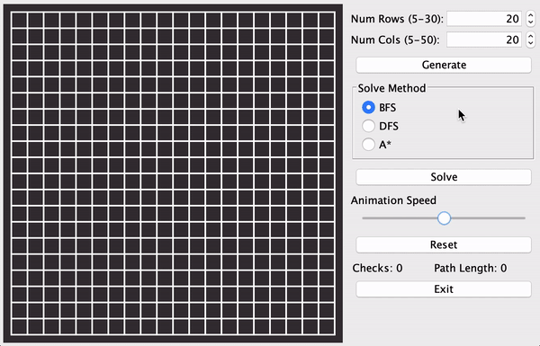

# MazeSolver

A maze solver Java application that automatically generates a random maze, and then proceeds to traverse and solve the
maze using a variety of graph traversal algorithms (BFS, DFS, A*). This generation and traversal is visualized using
JSwing, and allows the user to interact with the maze, enabling them to choose the size of the maze, the maze start and
end points, the solution algorithm, as well as vary the animation speed.

The application is written in Java 9.

See here for a quick write up of the project: https://mefchristiansen.github.io/projects/maze-solver/

## Installation

I used the Gradle build tool to build and run the application.

See here for Gradle installation instructions: https://gradle.org/install/

To build and run the application, run the following command:
`gradle run`
